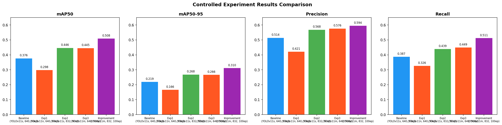
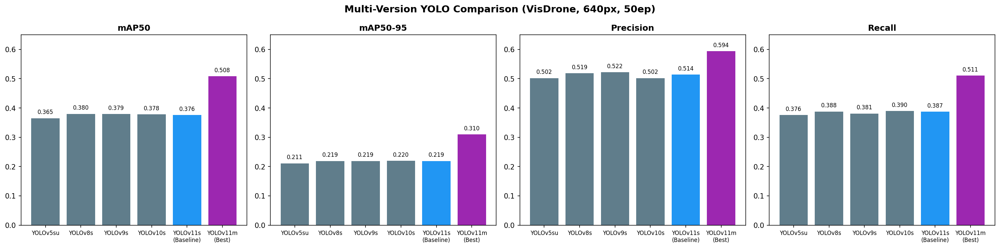
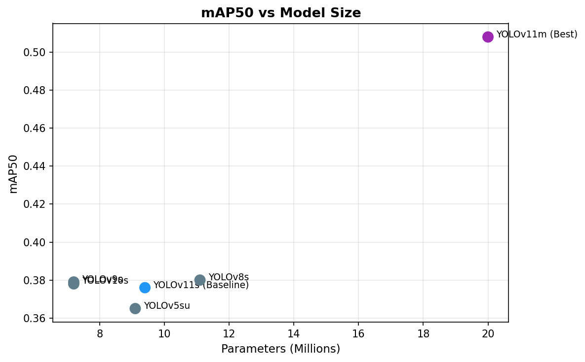

# CMPE 401 – Advanced Object Detection and Comparative Study using YOLOv11

## Project Overview
This project implements a complete object detection pipeline using YOLOv11 on the VisDrone dataset. It includes baseline training, structured experiments, iterative model improvements, and a multi-version YOLO comparison.

**Best Result:** YOLOv11m at 832px resolution, 100 epochs → **mAP50: 0.508**

---

## Dataset

[VisDrone2019-DET](https://github.com/VisDrone/VisDrone-Dataset) - drone-view 
object detection dataset with 10 classes:
`pedestrian, people, bicycle, car, van, truck, tricycle, awning-tricycle, bus, motor`

| Split | Images |
|---|---|
| Train | 6,471 |
| Val | 548 |
| Test-Dev | 1,610 |
| Test-Challenge | 1,580 |

---

## Results Summary

### Experiment Comparison

| Experiment | mAP50 | mAP50-95 | Precision | Recall |
|---|---|---|---|---|
| Baseline (YOLOv11s, 640, 50ep) | 0.376 | 0.219 | 0.514 | 0.387 |
| Exp1 (YOLOv11n, 640, 50ep) | 0.298 | 0.166 | 0.421 | 0.326 |
| Exp2 (YOLOv11s, 832, 50ep) | 0.446 | 0.268 | 0.568 | 0.439 |
| Exp3 (YOLOv11m, 640, 50ep) | 0.445 | 0.266 | 0.576 | 0.449 |
| **Improvement (YOLOv11m, 832, 100ep)** | **0.508** | **0.310** | **0.594** | **0.511** |

### Multi-Version YOLO Comparison

| Model | mAP50 | mAP50-95 | Precision | Recall | Params (M) |
|---|---|---|---|---|---|
| YOLOv5su | 0.365 | 0.211 | 0.502 | 0.376 | 9.1 |
| YOLOv8s | 0.380 | 0.219 | 0.519 | 0.388 | 11.1 |
| YOLOv9s | 0.379 | 0.219 | 0.522 | 0.381 | 7.2 |
| YOLOv10s | 0.378 | 0.220 | 0.502 | 0.390 | 7.2 |
| YOLOv11s | 0.376 | 0.219 | 0.514 | 0.387 | 9.4 |
| **YOLOv11m (best)** | **0.508** | **0.310** | **0.594** | **0.511** | 20.0 |

### Visualizations




---

## Repository Structure

```bash
cmpe401-yolo-object-detection/
├── data/
│   └── visdrone/          # dataset (not tracked in git)
├── experiments/
│   ├── results/           # training outputs, plots, metrics
│   └── REPORT.md          # full project report
├── notebooks/
│   └── analysis.ipynb     # loss curves, metrics plots, comparison tables
├── scripts/
│   ├── convert_visdrone.py    # VisDrone → YOLO format converter
│   ├── train_baseline.py      # baseline training script
│   ├── train_experiments.py   # controlled experiments script
│   ├── train_comparison.py    # multi-version comparison script
│   └── setup_vastai.sh        # Vast.ai instance setup
└── requirements.txt
```

---

---

## Reproducing Results

### 1. Setup Environment
```bash
git https://github.com/thndlovu/CMPE-401-YOLO-OBJECT-DETECTION.git
cd CMPE-401-YOLO-OBJECT-DETECTION
pip install -r requirements.txt
```

### 2. Download VisDrone Dataset
Download from [VisDrone GitHub](https://github.com/VisDrone/VisDrone-Dataset):
- trainset (1.44 GB)
- valset (0.07 GB)
- testset-dev (0.28 GB)
- testset-challenge (0.28 GB)

Place in `data/visdrone/raw/` with structure:

```bash
data/visdrone/raw/
├── VisDrone2019-DET-train/
├── VisDrone2019-DET-val/
├── VisDrone2019-DET-test-dev/
└── VisDrone2019-DET-test-challenge/
```

---

### 3. Convert Dataset
```bash
python3 scripts/convert_visdrone.py \
  --visdrone_root data/visdrone/raw \
  --output_root data/visdrone/yolo
```

### 4. Train Baseline
```bash
python3 scripts/train_baseline.py
```

### 5. Run Experiments
```bash
# Run individual experiment (0=nano, 1=res832, 2=medium, 3=improvement)
python3 scripts/train_experiments.py --exp 0
```

### 6. Run Multi-Version Comparison
```bash
python3 scripts/train_comparison.py
```

---

## Key Findings
1. **Image resolution** has the highest single impact on VisDrone performance - increasing from 640 to 832px improved mAP50 by 18.6%
2. **Model capacity** provides complementary gains - YOLOv11m outperforms YOLOv11s by 18.4% at the same resolution
3. **Training duration** matters - 100 epochs significantly outperforms 50 epochs for larger model+resolution combinations
4. All YOLO versions (v5-v11) perform similarly at small scale on VisDrone, suggesting dataset characteristics matter more than architecture version
5. Small object classes (bicycle, awning-tricycle) remain challenging across all models, highlighting the difficulty of drone-view detection

---

## Tools & Infrastructure
- **Framework:** Ultralytics YOLOv11
- **GPU:** NVIDIA RTX 4090 (24GB VRAM) via Vast.ai
- **Dataset:** VisDrone2019-DET
- **Language:** Python 3.10

---

## Author
CMPE 401 - University of British Columbia Okanagan

