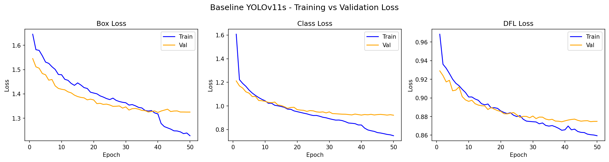
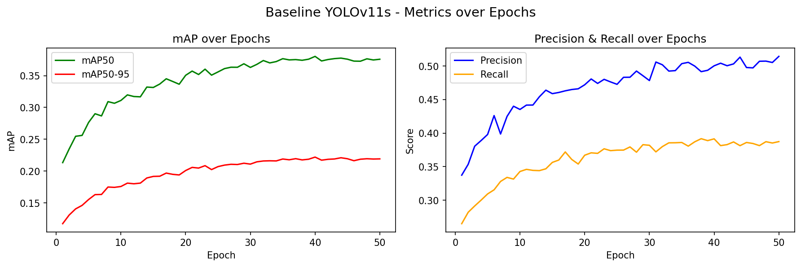

# CMPE 401 - Project 1 Report
## Advanced Object Detection and Comparative Study using YOLOv11

---

## Part I - Baseline Model

### Model Configuration
- **Model:** YOLOv11s (small)
- **Dataset:** VisDrone2019-DET
- **Epochs:** 50
- **Image Size:** 640x640
- **Batch Size:** 16
- **Device:** NVIDIA RTX 4090

### Baseline Results

| Metric | Value |
|---|---|
| mAP50 | 0.376 |
| mAP50-95 | 0.219 |
| Precision | 0.514 |
| Recall | 0.387 |
| Val Box Loss | 1.325 |
| Val Cls Loss | 0.921 |
| Val DFL Loss | 0.875 |

### Per-Class Results

| Class | Precision | Recall | mAP50 | mAP50-95 |
|---|---|---|---|---|
| pedestrian | 0.605 | 0.475 | 0.496 | 0.229 |
| people | 0.615 | 0.343 | 0.371 | 0.145 |
| bicycle | 0.333 | 0.243 | 0.195 | 0.092 |
| car | 0.768 | 0.816 | 0.827 | 0.580 |
| van | 0.567 | 0.498 | 0.497 | 0.355 |
| truck | 0.590 | 0.404 | 0.425 | 0.290 |
| tricycle | 0.461 | 0.340 | 0.336 | 0.190 |
| awning-tricycle | 0.327 | 0.195 | 0.163 | 0.099 |
| bus | 0.798 | 0.570 | 0.625 | 0.464 |
| motor | 0.612 | 0.507 | 0.528 | 0.241 |

---

## Part II - Loss Curve and Fitting Analysis

### Training vs Validation Loss

### Convergence Behavior
All three loss components (Box, Class, DFL) show consistent decreasing trends across all 50 epochs for both training and validation sets. Neither curve flattens completely by epoch 50, indicating the model has not fully converged and could benefit from additional training epochs.

### Overfitting Analysis
The model shows **mild overfitting** in the later epochs. Training loss continues to decrease while validation loss begins to plateau around epoch 35-40.
This gap between training and validation loss is expected given:
- **Dataset size:** VisDrone training set contains only 6,471 images, which is 
  relatively small for a complex 10-class detection task
- **Model capacity:** YOLOv11s has 9.4M parameters, which is sufficient capacity 
  to begin memorizing training patterns

### Underfitting Analysis
Early epochs (1-10) show classic underfitting behavior - both training and validation losses are high and the model rapidly improves. This is normal and expected at the start of training.

### Key Observations
- mAP50 improves from 0.21 to 0.376 over 50 epochs
- Precision (0.514) is notably higher than Recall (0.387), suggesting the model is conservative in its predictions - when it detects an object it is usually correct, but it misses many objects
- Small object classes (bicycle, awning-tricycle) have significantly lower mAP than large object classes (car, bus), consistent with the challenges of drone-view small object detection

---

## Part III - Structured Experimental Design

### Experimental Setup
All experiments use the same VisDrone dataset and training infrastructure. One variable is changed at a time to isolate its effect.

| Experiment | Model | Image Size | Epochs | Batch Size |
|---|---|---|---|---|
| Baseline | YOLOv11s | 640 | 50 | 16 |
| Exp1 | YOLOv11n | 640 | 50 | 16 |
| Exp2 | YOLOv11s | 832 | 50 | 8 |
| Exp3 | YOLOv11m | 640 | 50 | 16 |
| Exp4 (Improvement) | YOLOv11m | 832 | 100 | 8 |

### Results

| Experiment | mAP50 | mAP50-95 | Precision | Recall |
|---|---|---|---|---|
| Baseline (YOLOv11s, 640, 50ep) | 0.376 | 0.219 | 0.514 | 0.387 |
| Exp1 (YOLOv11n, 640, 50ep) | 0.298 | 0.166 | 0.421 | 0.326 |
| Exp2 (YOLOv11s, 832, 50ep) | 0.446 | 0.268 | 0.568 | 0.439 |
| Exp3 (YOLOv11m, 640, 50ep) | 0.445 | 0.266 | 0.576 | 0.449 |
| Exp4 (YOLOv11m, 832, 100ep) | **0.508** | **0.310** | **0.594** | **0.511** |

### Analysis

**Exp1 - Model Size (Nano vs Small):**
Reducing model size from YOLOv11s to YOLOv11n caused a significant drop in mAP50 from 0.376 to 0.298 (-20.7%). This confirms that model capacity is important for VisDrone's complex dense scenes. The nano model with only 2.6M parameters lacks sufficient capacity to learn the full complexity of 10-class drone-view detection.

**Exp2 - Image Resolution (640 vs 832):**
Increasing resolution from 640 to 832 improved mAP50 from 0.376 to 0.446 (+18.6%). This is the most impactful single change tested. Higher resolution preserves more detail for small objects which are a defining challenge of VisDrone. The tradeoff is increased memory usage requiring a reduced batch size from 16 to 8.

**Exp3 - Model Size (Small vs Medium):**
Upgrading from YOLOv11s to YOLOv11m improved mAP50 from 0.376 to 0.445 (+18.4%). The medium model's additional capacity (20M vs 9.4M parameters) allows it to learn more complex feature representations.

---

## Part IV - Iterative Model Improvement

### Improvement Cycle

**Baseline:** YOLOv11s, 640px, 50 epochs → mAP50: 0.376

**Hypothesis:** Both resolution and model capacity independently improved performance. Combining them should yield additive gains. Additionally, more epochs are needed since loss curves had not fully converged at epoch 50.

**Experimental Settings:**
- Model: YOLOv11m (larger capacity)
- Image Size: 832px (higher resolution)
- Epochs: 100 (allow full convergence)
- Batch Size: 8 (reduced due to memory)

**Controlled Modification:** Three simultaneous changes grounded in findings from Exp2 and Exp3 - resolution, capacity, and training duration.

**Evaluation:**

| Metric | Baseline | Improvement | Change |
|---|---|---|---|
| mAP50 | 0.376 | **0.508** | +35.1% |
| mAP50-95 | 0.219 | **0.310** | +41.6% |
| Precision | 0.514 | **0.594** | +15.6% |
| Recall | 0.387 | **0.511** | +32.0% |

**Analysis:** The improvement cycle yielded the best results across all metrics. The combination of higher resolution, larger model, and more training epochs 
proved highly effective for VisDrone's small object detection challenge.

**Conclusion:** For drone-view object detection with small, dense objects:
1. Image resolution has the highest impact per parameter cost
2. Model capacity provides complementary gains
3. Allowing full convergence (100 epochs) is important - 50 epochs was 
   insufficient for the more complex model+resolution combination

---

## Part V - Multi-Version YOLO Comparison

### Comparison Setup
All models trained under identical conditions:
- Dataset: VisDrone2019-DET
- Epochs: 50
- Image Size: 640
- Batch Size: 16
- Device: NVIDIA RTX 4090

### Results

| Model | mAP50 | mAP50-95 | Precision | Recall | Params (M) | Inference (ms/img) |
|---|---|---|---|---|---|---|
| YOLOv5su | 0.365 | 0.211 | 0.502 | 0.376 | 9.1 | 4.2 |
| YOLOv8s | 0.380 | 0.219 | 0.519 | 0.388 | 11.1 | 0.6 |
| YOLOv9s | 0.379 | 0.219 | 0.522 | 0.381 | 7.2 | 6.0 |
| YOLOv10s | 0.378 | 0.220 | 0.502 | 0.390 | 7.2 | 0.4 |
| YOLOv11s (Baseline) | 0.376 | 0.219 | 0.514 | 0.387 | 9.4 | 5.5 |
| **YOLOv11m (Best)** | **0.508** | **0.310** | **0.594** | **0.511** | 20.0 | 1.5 |

### Analysis
At the small model scale (640px, 50 epochs), all YOLO versions perform remarkably similarly - mAP50 ranges from 0.365 to 0.380. This suggests that for VisDrone, the choice of model version matters less than hyperparameter choices like resolution and training duration. 

YOLOv9s achieves the best precision (0.522) at the smallest parameter count (7.2M), making it the most parameter-efficient model at this scale.

YOLOv8s edges out YOLOv11s slightly at the same scale (0.380 vs 0.376), though the difference is negligible. YOLOv11's advantage becomes clear when 
scaled up - YOLOv11m with optimized settings achieves 0.508 mAP50, a 35% improvement over all small-scale competitors.

YOLOv5su performs worst overall, consistent with it being the oldest architecture in the comparison.